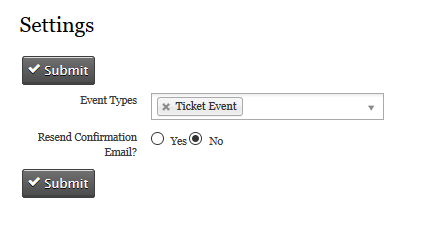
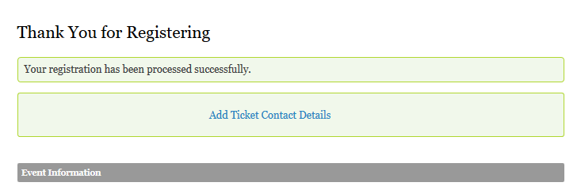
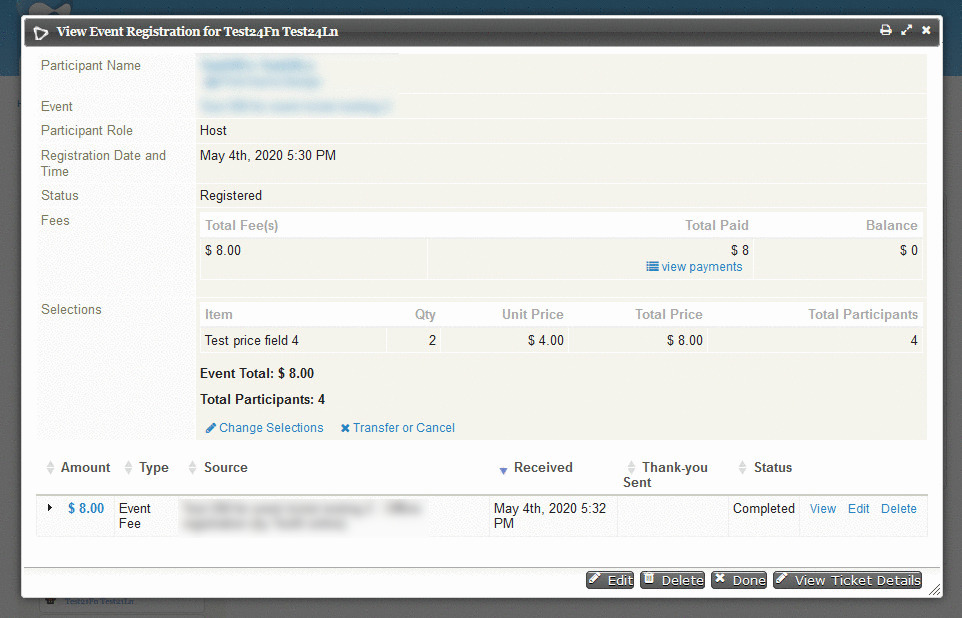
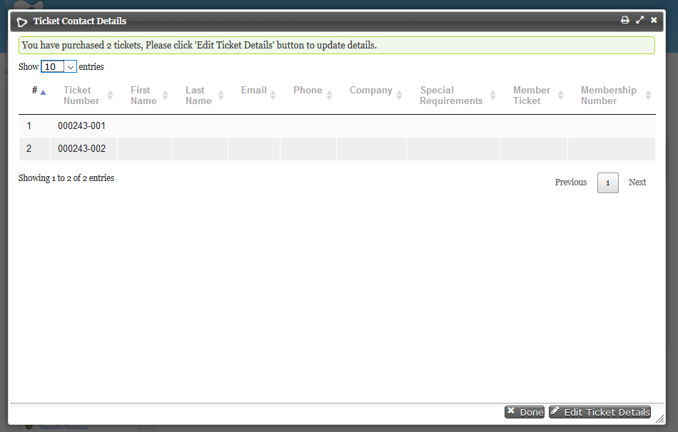

# uk.co.vedaconsulting.eventtickets #

### Overview ###

This extension facilitates user to create tickets for the participants registering for events which belongs to the selected event types.

### Installation ###
* Install the extension in CiviCRM. More details [here](https://docs.civicrm.org/sysadmin/en/latest/customize/extensions/#installing-a-new-extension) about installing extensions in CiviCRM.

* While installing the extension the following custom fields are created under the custom group 'Event Ticket Details' :

	1. First name
	2. Last name
	3. Email
	4. Phone
	5. Company
	6. Special Requirements
	7. Ticket Number
	8. Is Member Ticket
	9. Membership Number

* For each ticket purchased by a participant, these ticket details are stored in the custom table.
* The ticket numbers will be automatically generated once the tickets are purchased.

* For configuring the Event types
* Configure the Ticket Event settings in **Events >> Ticket Event Type Settings**

* The Settings Page has two configurations:
	1. Selecting the event types which are of Ticketed Event
	2. Resend Confirmation Email:  Yes or No.

### Usage ###

* By default an event type called 'Ticket Event' will be created while installing the extension and it will be added to the ticket event type.

* After registering the participants for the event, at the thank you page there is an option to add the 'Add Ticket Contact Details'.

* Also while viewing the participant details a button to view and/or edit the ticket details.

* The extension is licensed under [AGPL-3.0](LICENSE.txt).

## Requirements

* PHP v7.0+
* CiviCRM 5.20

## Installation (Web UI)

This extension has not yet been published for installation via the web UI.

### Support ###

support@vedaconsulting.co.uk
